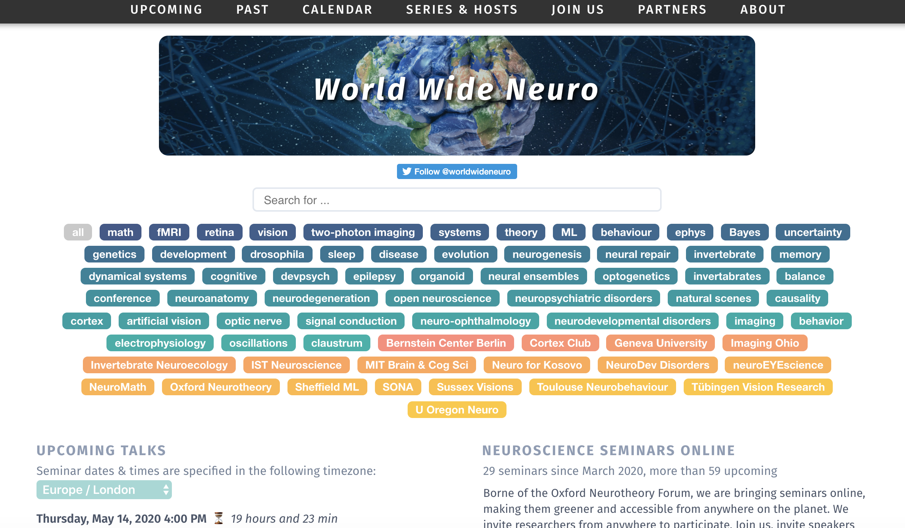

  <h1>
    World Wide Neuro website 🧠🗺️🖥️
  </h1>
  
  

  
  
  

    <strong><i>Scientific seminars from all over the world</i></strong>

  

    <strong><a href="https://worldwideneuro.com">worldwideneuro.com</a></strong>
  

  

    <i>Envisaged by Tim Vogels Developed by Panos Bozelos</i>
  

 

## Feature check-list 🧭

- [x] Homepage: search bar, topic & series tags, date-sorted filterable seminar listings
- [x] Seminar series pages
- [x] Individual seminar events
- [ ] Photo galleries
- [ ] Keywords
- [ ] Static urls
  

## Tools 🚀

Programming Languages: HTML, CSS, JavaScript, and Python
Server Details: Ubuntu 18.04, Amazon Web Services

  

## Feel like contributing? ✏️

Feel free to contribute with code, we will greatly appreciate it.
  

## Acknowledgements 🙏

Our work was supported by a Wellcome Trust Senior Research Fellowship, a BBSRC grant, and an ERC consolidator Grant "SYNAPSEEK". worldwideneuro.com is partly sponsored by ELife, the FENS Kavli Network, and Phenosys. The authors would like to thank Denis Jabaudan, Tom Baden, Adam Calhoun and the Society of Neuroscientists in Africa (SONA) for early support.
